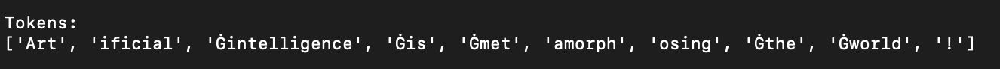
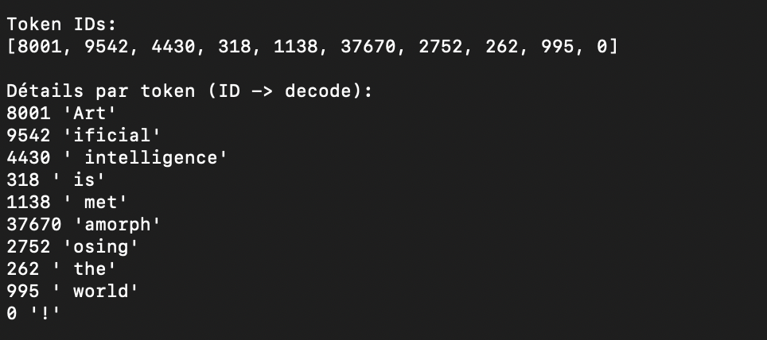
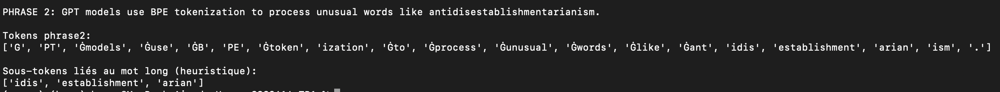
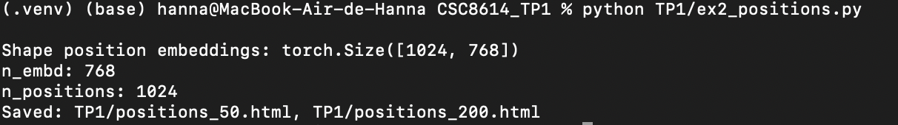
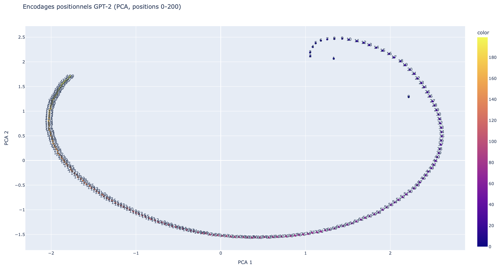
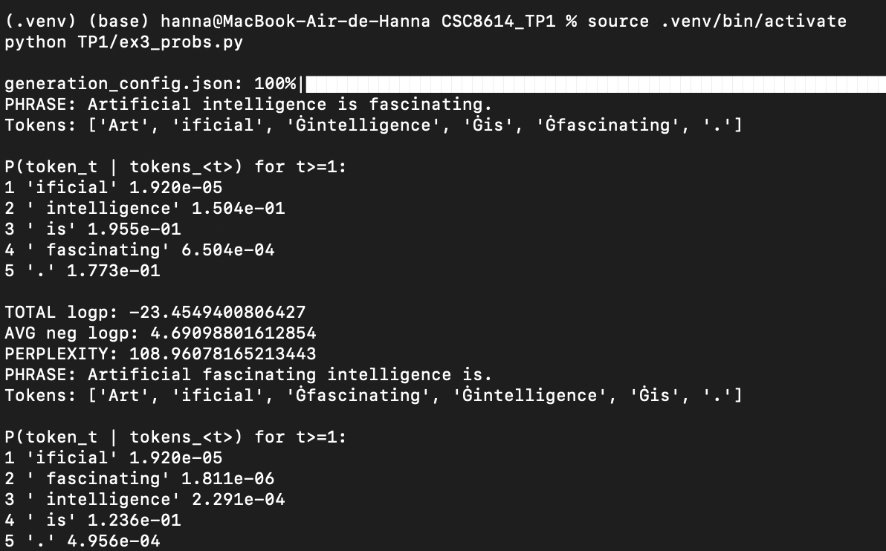
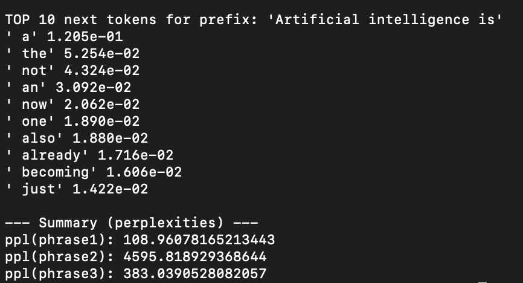
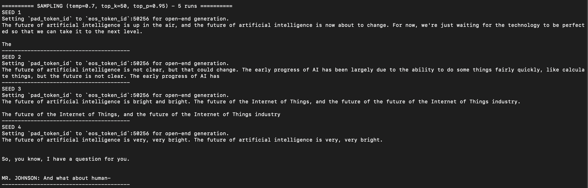

# CSC 8614 – TP1 : Modèles de langage

**Nom / Prénom :** Hanna Haddaoui  
**OS :** macOS
**Python :** (ex: 3.11.x)  
**Libs :** transformers==..., torch==..., plotly==..., scikit-learn==...

## Installation / environnement

```bash
python3 -m venv .venv
source .venv/bin/activate
pip install -r TP1/requirements.txt

```

## Exerice 1



Le symbole Ġ en début de token indique généralement une frontière de mot précédée d’un espace. Dans GPT-2, l’espace fait partie de la représentation : un token comme Ġintelligence correspond en pratique à “ intelligence”. Cela permet au modèle de distinguer un fragment en début de séquence d’un fragment qui apparaît après un espace, et de capturer plus fidèlement les régularités statistiques du texte. Ce marquage facilite aussi le fonctionnement de BPE, qui apprend des sous-unités fréquentes en tenant compte des contextes réels d’apparition (souvent “ + mot”).



| Décodage (repr) |    ID | Remarque                         |
| --------------- | ----: | -------------------------------- |
| 'Art'           |  8001 | fragment de mot                  |
| 'ificial'       |  9542 | suite de mot              |
| ' intelligence' |  4430 | espace inclus|
| ' is'           |   318 | espace inclus                    |
| ' met'          |  1138 | début de mot avec espace         |
| 'amorph'        | 37670 | sous-mot interne                 |
| 'osing'         |  2752 | fin de mot                       |
| '!'             |     0 | ponctuation isolée               |


Les tokens sont des unités textuelles (souvent des sous-mots) produites par le tokenizer, alors que les token IDs sont les entiers correspondants dans le vocabulaire du modèle. Le modèle ne manipule que les IDs : ils servent d’index pour les embeddings et pour produire les distributions de probabilité sur le vocabulaire.
On observe ici que GPT-2 ne segmente pas forcément en mots entiers : “Artificial” est coupé en “Art” + “ificial”, et “metamorphosing” en “Ġmet” + “amorph” + “osing”, ce qui illustre l’idée BPE de composer des mots à partir de fragments fréquents. Les espaces ne sont pas des tokens séparés mais sont intégrés au token suivant (décodage montrant “ intelligence”, “ is”, “ the”, “ world”), ce qui encode explicitement la frontière de mot. La ponctuation est souvent isolée (“!” seul), ce qui simplifie la modélisation de ces symboles. Globalement, le découpage reflète une stratégie de réutilisation de sous-unités apprises : les morceaux apparaissent comme des briques réutilisables, particulièrement utiles pour les mots rares ou longs.



Le mot antidisestablishmentarianism est représenté par 5 sous-tokens. Il est découpé de cette manière parce qu’il est très rare en tant qu’unité entière dans les données, alors que ses segments (ant, establishment, arian, ism, etc.) apparaissent plus souvent et constituent des morceaux stables que BPE peut recombiner. Cette segmentation permet de traiter correctement des mots inconnus ou peu fréquents sans avoir besoin d’un token unique par mot, tout en gardant une représentation exploitable par le modèle.


## Exerice 2



Shape position embeddings: torch.Size([1024, 768]). La première dimension (1024) correspond au nombre de positions possibles dans la fenêtre de contexte, et la seconde (768) est la dimension de chaque vecteur d’encodage positionnel (même dimension que les embeddings du modèle, n_embd=768). n_positions=1024 indique la longueur maximale de contexte prise en charge par GPT-2 : le modèle possède des embeddings positionnels appris pour les positions 0 à 1023, donc il ne peut pas conditionner correctement au-delà de 1024 tokens sans adaptation.


On voit une trajectoire très régulière : la majorité des points s’alignent sur une courbe lisse, avec un gradient de couleur cohérent et des indices qui suivent l’ordre le long de la courbe. Les positions proches restent proches en 2D, ce qui suggère que les embeddings positionnels évoluent progressivement quand l’index augmente. Il y a aussi un point très isolé (en haut à gauche), nettement séparé du “chemin” principal : certaines positions (probablement au tout début) ont une représentation très différente dans les deux premières composantes. Globalement, la structure n’a rien d’aléatoire : on perçoit une organisation continue, avec une petite rupture/outlier au démarrage.
L’intérêt de la PCA ici est simplement de rendre visualisable une matrice en 768 dimensions : on projette en 2D en conservant le maximum de variance, ce qui permet de repérer d’un coup d’œil continuité, trajectoire globale et points atypiques.



À 0–200, la structure devient beaucoup plus “globale” : on obtient une grande forme en arc/anneau, comme une ellipse, et les positions se répartissent sur cette boucle en suivant l’ordre (couleurs/labels). Par rapport à 0–50, la densité augmente et les détails locaux deviennent moins lisibles, mais la géométrie d’ensemble ressort mieux : on ne voit plus juste un segment de courbe, on voit la continuité sur une longue plage de positions. On remarque aussi une séparation nette entre des zones de la boucle (deux “branches” visuellement), ce qui indique que la variation avec la position n’est pas purement linéaire dans les deux premières composantes.
Hypothèse : les embeddings positionnels appris vivent sur une variété de faible dimension où la position se code par une progression quasi “rotatoire” (d’où la boucle en PCA), avec des zones où la dynamique change (début de séquence vs positions plus grandes). La projection 2D comprime forcément l’information : des positions éloignées peuvent se retrouver proches sur la figure, ce qui suggère une certaine redondance dans ces 2 composantes, même si en 768D les embeddings restent distincts.


## Exerice 3



On lit la proba du token t dans les logits à la position t-1 car GPT-2 prédit toujours le prochain token : à l’instant t-1, le modèle n’a vu que les tokens jusqu’à t-1 et sa sortie à cette position est précisément la distribution pour le token suivant (token t). Les logits à la position t, eux, serviraient à prédire le token t+1.

b) 

Valeurs numériques obtenues :
"Artificial intelligence is fascinating." : total_logp = -23.4549400806427 ; perplexity = 108.96078165213443
"Artificial fascinating intelligence is." : total_logp = -42.16451120376587 ; perplexity = 4595.818929368644
"L'intelligence artificielle est fascinante." : total_logp = -59.481369495391846 ; perplexity = 383.0390528082057

La perplexité mesure à quel point le modèle est “surpris” par une phrase, en agrégeant la difficulté à prédire chaque token suivant. On somme les log-probabilités conditionnelles plutôt que de multiplier les probabilités pour éviter les underflows (produits de très petits nombres). Plus la perplexité est faible, plus le modèle attribue de fortes probabilités aux tokens réellement observés, donc la phrase est jugée plus “naturelle” selon ce qu’il a appris. Une perplexité élevée indique que plusieurs transitions sont peu probables et que la séquence sort des régularités apprises. On peut l’interpréter comme un nombre effectif de choix moyen par token : plus elle est grande, plus le modèle hésite. C’est une mesure relative, dépendante du modèle et du texte considéré.

c) 

Perplexités :

"Artificial intelligence is fascinating." : 108.96078165213443 (total_logp = -23.4549400806427)
"Artificial fascinating intelligence is." : 4595.818929368644 (total_logp = -42.16451120376587)

Constat : la phrase permutée a une perplexité énormément plus élevée, donc le modèle est beaucoup plus “surpris” et attribue des probabilités conditionnelles bien plus faibles à plusieurs tokens. La différence vient surtout de la grammaticalité et des enchaînements appris : “intelligence is” et “is fascinating” sont des transitions très fréquentes en anglais, alors que “fascinating intelligence is” est un ordre atypique. GPT-2 a été entraîné à prédire le prochain token sur du texte majoritairement grammatical ; il internalise des régularités (syntaxe, collocations, patrons de phrase). Quand l’ordre casse ces régularités, les probabilités chutent sur des tokens clés, la somme des log-probas devient beaucoup plus négative et la perplexité explose.

d)
Perplexité: 383.0390528082057.

Constat : elle est plus élevée que la phrase anglaise correcte (108.96), donc GPT-2 est moins à l’aise pour prédire cette séquence, mais elle reste bien plus basse que la phrase anglaise permutée (4595.82). Une explication simple est que GPT-2 est majoritairement entraîné sur de l’anglais : le français apparaît moins souvent, et certains enchaînements sont moins fréquents dans ses données. La tokenisation joue aussi : la phrase est découpée en fragments (“artific” + “iel” + “le”, “fasc” + “in” + “ante”), et ces sous-tokens peuvent être moins probables que des mots/segments très courants en anglais, ce qui augmente la perplexité globale.

e)


C’est plausible, c'est des continuations très fréquentes après “is” (déterminants, négation, adverbes, verbes). On voit des tokens avec un espace initial (' a', ' the', etc.), ce qui est normal avec GPT-2 : l’espace est souvent intégré au token. Pas de ponctuation dans ce top-10 ici, le modèle privilégie des mots qui prolongent la phrase.

## Exerice 4

Seed : SEED = 42. On fixe un seed pour rendre les expériences de génération reproductibles quand il y a de l’aléatoire. Sans seed, deux exécutions peuvent produire des textes différents.

### Greedy decoding (max_length=50)

```txt
The future of artificial intelligence is uncertain.

"We're not sure what the future will look like," said Dr. Michael S. Schoenfeld, a professor of computer science at the University of California, Berkeley. "But we're not
````

En relançant plusieurs fois, la sortie reste identique ici : le greedy choisit systématiquement le token le plus probable à chaque étape (pas de tirage), donc il est déterministe à paramètres identiques.

### Sampling (temp=0.7, top_k=50, top_p=0.95)

Exemples (2 sorties différentes) :

SEED 1

```txt
The future of artificial intelligence is up in the air, and the future of artificial intelligence is now about to change. For now, we're just waiting for the technology to be perfected so that we can take it to the next level.

The
```

SEED 4

```txt
The future of artificial intelligence is very, very bright. The future of artificial intelligence is very, very bright.


So, you know, I have a question for you.


MR. JOHNSON: And what about human-
```



Comparé au greedy, le sampling augmente nettement la diversité : le contenu varie d’un seed à l’autre, parfois avec des répétitions (“future of artificial intelligence…”), des ruptures de style (interview) ou des fins abruptes. La température règle le niveau d’audace (plus haut = plus varié), top-k limite le tirage aux k tokens les plus probables, et top-p (nucleus) limite le tirage au plus petit ensemble de tokens couvrant une masse de probabilité donnée (ici 0.95), ce qui évite des choix trop improbables.

### Pénalité de répétition (repetition_penalty=2.0)

Sans pénalité (seed=1) :

```txt
The future of artificial intelligence is up in the air, and the future of artificial intelligence is now about to change. For now, we're just waiting for the technology to be perfected so that we can take it to the next level.

The
```

Avec pénalité (seed=1) :

```txt
The future of artificial intelligence is up in the air, and it may not be as interesting or useful to us humans. But we're going down a path where our ability for thinking about things could become less important than ever before."
 (Photo:
```

La répétition baisse clairement : la reformulation évite de répéter “the future of artificial intelligence is …” deux fois de suite. Effet secondaire visible : le texte peut devenir plus “cassé” ou finir de manière moins propre (parenthèse “(Photo:”).

### Température très basse vs très élevée (top_k=50, top_p=0.95, seed=1)

Temp=0.1 :

```txt
The future of artificial intelligence is uncertain. But the future of artificial intelligence is not.

The future of artificial intelligence is not.

The future of artificial intelligence is not.

The future of artificial intelligence is not.

The
```

Temp=2.0 :

```txt
The future of artificial intelligence is up in the air again in 2014 as Google unveils its new platform called MachineStory-AI called Watson from the Stanford Institute for Artificial Intelligence (SetBorg). For IBM and for everyone trying to get their heads in
```

Température basse : sortie très conservatrice, mais répétitive et vite bloquée sur une boucle. Température haute : beaucoup plus créative, mais cohérence plus fragile (mélange d’entités/infos, formulations moins crédibles).

### Beam search (num_beams=5, max_length=50)

```txt
The future of artificial intelligence is in the hands of the next generation of scientists and engineers.

The future of artificial intelligence is in the hands of the next generation of scientists and engineers.

The future of artificial intelligence is in the hands of
```

Beam search tend à produire une continuation globalement très probable mais souvent plus générique, et ici il amplifie une répétition de phrase complète. Il est moins divers que le sampling car il explore plusieurs candidats mais retient la séquence la plus probable au global.

### Impact du nombre de beams (temps)

* num_beams=5 : 0.723s
* num_beams=10 : 0.867s
* num_beams=20 : 1.413s

Augmenter le nombre de beams ralentit car on conserve et on score plus d’hypothèses à chaque pas de génération : plus de chemins à explorer et à comparer, donc plus de calcul.

