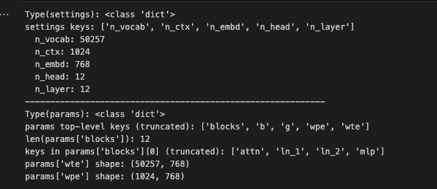
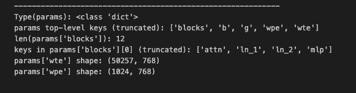
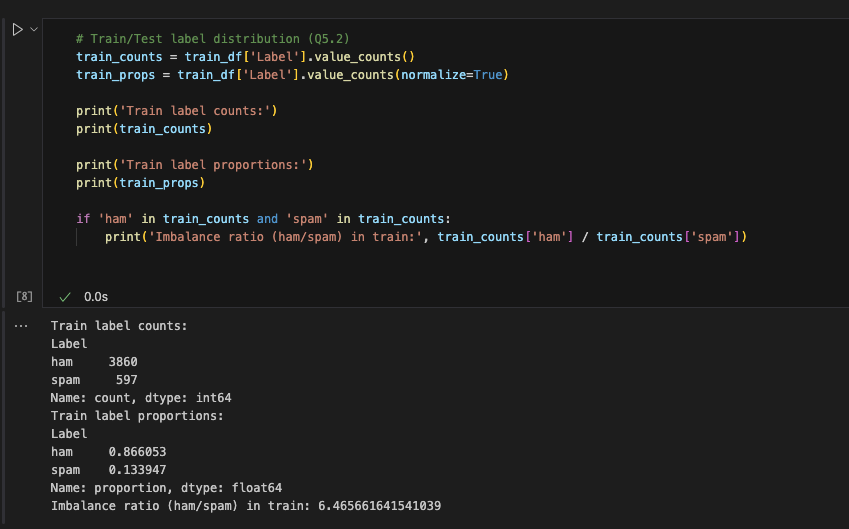
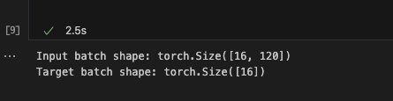
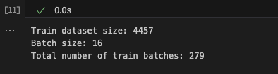
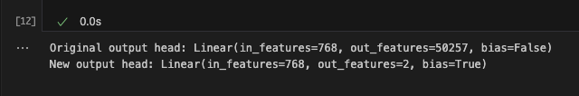
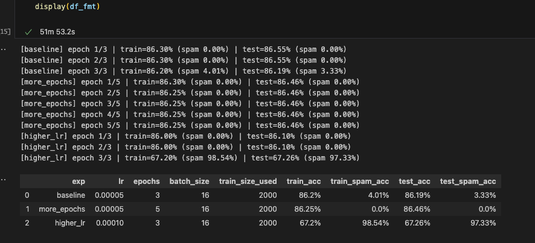
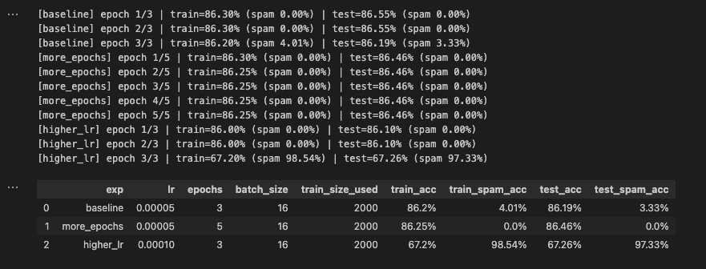
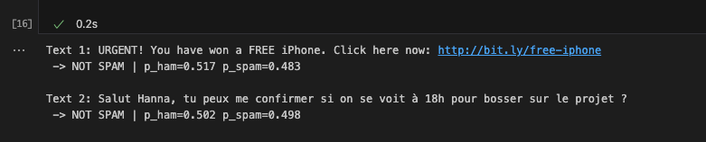

TP2: CSC8614 Language Models
CI2 Fine-tuning a language model for text classification (Spam Detection)

Hanna Haddaoui

Question 2. L’objet settings est un dictionnaire Python (type dict). Sa structure correspond aux hyperparamètres du modèle GPT-2 124M. Les clés observées sont n_vocab, n_ctx, n_embd, n_head, n_layer. Les valeurs associées dans mon exécution sont n_vocab=50257, n_ctx=1024, n_embd=768, n_head=12, n_layer=12. Preuve à coller : la sortie qui affiche le type de settings, la liste des clés et les valeurs.

Question 3. L’objet params est également un dictionnaire Python (type dict) qui contient les poids du modèle pré-entraîné. Les clés top-level observées incluent blocks, b, g, wpe, wte. La clé blocks contient une liste de longueur 12, ce qui correspond au nombre de couches transformer du GPT-2 small. À l’intérieur d’un bloc, on observe typiquement les sous-composants attn, ln_1, ln_2, mlp. Les tenseurs d’embeddings ont les dimensions attendues : wte a la forme (50257, 768) et wpe a la forme (1024, 768). Preuve à coller : la sortie qui affiche le type de params, les clés top-level, len(blocks), les clés de blocks[0] et les shapes de wte/wpe.

Question 4. La méthode __init__ de GPTModel attend une configuration cfg sous forme de dictionnaire avec des clés propres à l’implémentation du TP : vocab_size, context_length, emb_dim, n_heads, n_layers, drop_rate, qkv_bias. Le dictionnaire settings chargé depuis les poids OpenAI n’est pas directement au bon format car il utilise des noms de champs différents (n_vocab, n_ctx, n_embd, n_head, n_layer). J’effectue donc un mapping vers un dictionnaire model_config, en conservant drop_rate=0.1 et qkv_bias=True. Le mapping est le suivant : vocab_size=settings["n_vocab"], context_length=settings["n_ctx"], emb_dim=settings["n_embd"], n_heads=settings["n_head"], n_layers=settings["n_layer"], drop_rate=0.1, qkv_bias=True. Après chargement des poids dans GPTModel, le modèle est correctement instancié. Preuve à coller : la cellule montrant model_config et le message de succès “GPT-2 Model Loaded and Configured successfully!”.

Question 5.1. La ligne df = df.sample(frac=1, random_state=123) sert à mélanger aléatoirement toutes les lignes avant de réaliser le split 80/20, afin d’éviter un biais lié à l’ordre initial du fichier et d’obtenir un découpage train/test plus représentatif. L’argument random_state fixe ce mélange et rend le split reproductible.

Question 5.2. Le dataset est déséquilibré. Après split, j’obtiens train=4457 et test=1115. Dans le train, la classe ham compte 3860 exemples, la classe spam 597 exemples. Cela correspond à environ 86.61% ham et 13.39% spam, avec un ratio ham/spam d’environ 6.47. Ce déséquilibre peut conduire à un modèle qui maximise l’accuracy globale en privilégiant la prédiction ham, tout en ratant un grand nombre de spams. Il est donc pertinent de suivre une métrique spécifique sur la classe spam et, si nécessaire, de pondérer la loss pour pénaliser davantage les erreurs sur la classe minoritaire. Preuve à coller : la sortie qui affiche les counts, les proportions et le ratio.

Question 6. Les DataLoaders sont créés avec batch_size=16, shuffle=True pour l’entraînement et shuffle=False pour le test. La vérification des dimensions confirme que chaque batch d’inputs a la forme [16, 120] (séquence tokenisée et paddée à 120), et que les labels ont la forme [16]. Preuve à coller : la sortie “Input batch shape: torch.Size([16, 120])” et “Target batch shape: torch.Size([16])”.

Question 7. Avec un train set de 4457 exemples et un batch_size de 16, le nombre total de batches d’entraînement est len(train_loader)=279 (ce qui correspond à ceil(4457/16)). Dans mon exécution, je n’ai pas sous-échantillonné le train set : train_dataset size = 4457. Preuve à coller : la sortie qui affiche la taille du train, le batch size et “Total number of train batches: 279”.

Question 8.1. La tâche est une classification binaire (ham vs spam), donc num_classes=2.

Question 8.2. La tête de sortie originale du GPT-2 small projette l’état caché vers un vocabulaire de taille 50257. Dans mon exécution, elle est affichée comme Linear(in_features=768, out_features=50257, bias=False). Pour la classification, je remplace out_head par une couche Linear(in_features=768, out_features=2, bias=True). La nouvelle tête est affichée comme Linear(in_features=768, out_features=2, bias=True). Preuve à coller : la sortie “Original output head …” puis “New output head …”.

Question 8.3. Je gèle les couches internes (param.requires_grad=False) afin de conserver les représentations pré-entraînées du modèle et de limiter l’entraînement aux paramètres strictement nécessaires à la nouvelle tâche. Cela réduit le risque de dégrader le langage appris, accélère l’entraînement, et stabilise l’adaptation sur un dataset relativement petit. Seule la nouvelle tête de sortie et la dernière normalisation (LayerNorm final du dernier bloc) restent entraînables pour permettre une adaptation légère mais utile.

Question 9. Le fine-tuning suit le schéma standard : remise à zéro des gradients via optimizer.zero_grad(set_to_none=True), calcul de la loss via une cross-entropy, rétro-propagation via loss.backward(), mise à jour via optimizer.step(). Les logits utilisés pour la classification sont ceux du dernier token de la séquence : logits = model(inputs)[:, -1, :]. L’évaluation calcule l’accuracy globale et l’accuracy restreinte aux exemples spam via la fonction calc_accuracy.

Pondération des classes (déséquilibre). Je calcule count_ham et count_spam sur train_df puis j’utilise un poids positif pos_weight = count_ham / count_spam ≈ 6.4657. Les class_weights sont donc tensor([1.0000, 6.4657]), ce qui pénalise davantage les erreurs sur la classe spam. Preuve possible à coller : la sortie “Using class weights: tensor([1.0000, 6.4657])”.

Question 10. La loss diminue globalement au fil des batches, avec une variabilité normale d’un mini-batch à l’autre. En début d’apprentissage, la loss est élevée (ex. ~4.78 au batch 0), puis elle passe fréquemment sous 1 sur la suite, ce qui indique que la nouvelle tête de classification apprend une séparation utile entre ham et spam. En fin d’entraînement (3 epochs), les métriques confirment cet apprentissage : Train Acc = 86.92% avec Spam Acc = 67.67%, et Test Acc = 88.52% avec Spam Acc = 70.00%. L’écart entre accuracy globale et accuracy spam reflète le caractère minoritaire et plus difficile de la classe spam, mais la performance spam sur test montre que le modèle ne se contente pas de prédire ham systématiquement. Preuve à coller : la ligne finale “Epoch 3: Train Acc: 86.92% (Spam: 67.67%) | Test Acc: 88.52% (Spam: 70.00%)”.

Question 11 (optionnel). J’ai prévu d’évaluer l’impact du nombre d’époques, du learning rate et d’un éventuel sous-échantillonnage du train set, en comparant au minimum une configuration baseline (lr=5e-5, epochs=3), une configuration avec plus d’époques (epochs=5) et une configuration avec un lr plus élevé (lr=1e-4). Pour chaque configuration, je reporte Train Acc, Train Spam Acc, Test Acc, Test Spam Acc dans un tableau afin d’observer si l’amélioration se fait surtout sur la généralisation et si la classe spam bénéficie réellement des changements. Preuves attendues : capture du tableau récapitulatif des expériences et, si pertinent, deux ou trois lignes de logs par configuration. Si Q11 n’est pas réalisée, cette section est omise.

Question 12 (optionnel). Je teste le modèle sur deux messages “maison”, un spam-like et un normal. Je reporte la prédiction SPAM/NOT SPAM (et éventuellement les probabilités via softmax si j’utilise la version enrichie). Preuves attendues : la sortie des deux prints montrant le texte et la classe prédite. Si Q12 n’est pas réalisée, cette section est omise.

