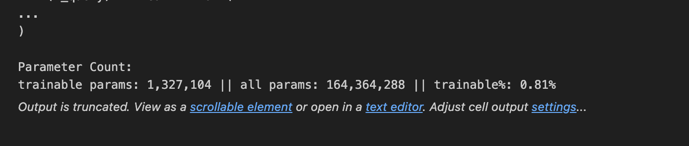
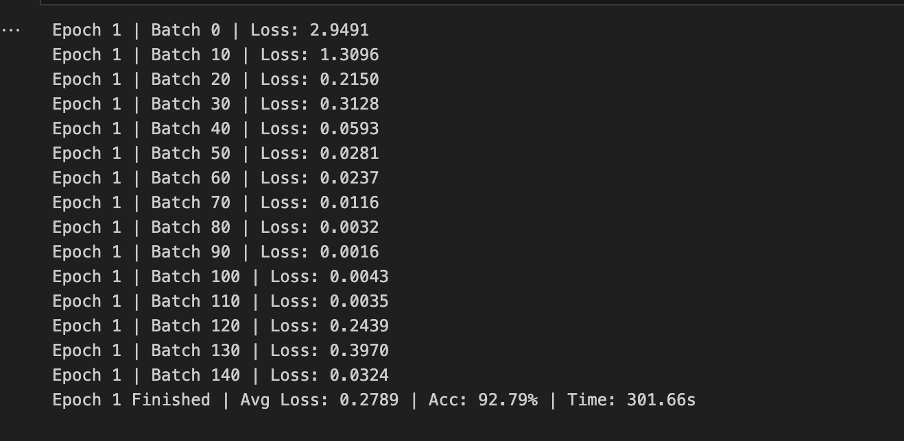
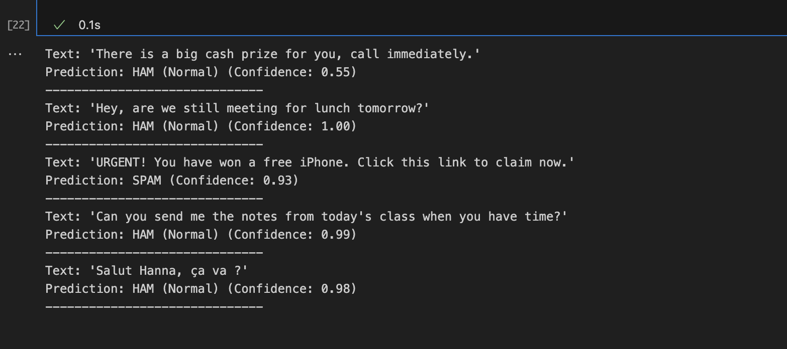

# RAPPORT TP3 

#### Hanna HADDAOUI

1) Yes. In the original structure, the layers are Linear(...). After injection, they become LinearWithLoRA(...) (e.g., W_query), which shows that the wrapper has correctly replaced the nn.Linear in the transformer blocks.

2) We have
Trainables : 1,327,104
Total : 164,364,288
Fraction trainable : 0.81%

3) Yes, there is a difference. After replacing `out_head` with a 2-class classification head and unfreezing this head, the number of trainable parameters increases slightly, and the fraction changes: it goes from 1,327,104 / 164,364,288 (0.81%) to 1,328,642 / 125,768,450 (1.06%). The increase comes from the weights and biases of the new head (`nn.Linear(hidden_dim→2)`), and the total decreases because the initial vocabulary projection (very large, `hidden_dim→vocab_size`) is replaced by a much smaller projection.

4) The loss drops very quickly at the beginning (≈2.95 in batch 0 -> ≈1.31 in batch 10 -> <0.1 from ~batch 40 onwards), then remains generally very low with a few occasional peaks at the end of the epoch (e.g., batches 120–130) which can be explained by the variability between mini-batches (more “difficult” batches, optimization noise). At the end of epoch 1, we obtain an average loss ≈0.279 and a training accuracy ≈92.79%. This is consistent and reasonable for a binary spam/ham task on a fairly simple and balanced dataset, especially with a pre-trained model and a classification head; the real validation is the performance on the test set (Q5) to verify the generalization and detect any overfitting.

5) The accuracy on the test set is 97.66%, which is very high. It is even higher than the train accuracy observed at the end of the epoch (92.79%). This is plausible, as the displayed train accuracy is an average during training (train model with noise from mini-batches, gradients, and potential dropouts), whereas the evaluation is performed using `eval()` without dropouts and across the entire test, and is therefore often more stable. The fact that the test accuracy is not lower than the train accuracy suggests that there is no overfitting on this configuration (and that the task is relatively easy once adapted).

5) In inference tests, the classifier behaves consistently: everyday messages (“meeting for lunch”, “send me the notes”, “Salut Hanna…”) are predicted to be HAM with very high confidence (≈0.98–1.00), while explicit spam (“URGENT… free iPhone… click…”) is detected as SPAM with high confidence (0.93). A more ambiguous case appears with “big cash prize… call immediately”: the model classifies it as HAM but with low confidence (0.55), reflecting hesitation regarding a less stereotypical spam pattern. Overall, despite minimal fine-tuning (LoRA + head, 1 epoch), high accuracy is achieved on the test (97.66%), along with qualitatively relevant predictions, while training only a fraction of the parameters. Conclusion: LoRA enables efficient and rapid adaptation of pre-trained GPT to a classification task, with a good cost/performance compromise, and residual errors are mainly concentrated on borderline messages where a decision threshold or more training could improve robustness.

